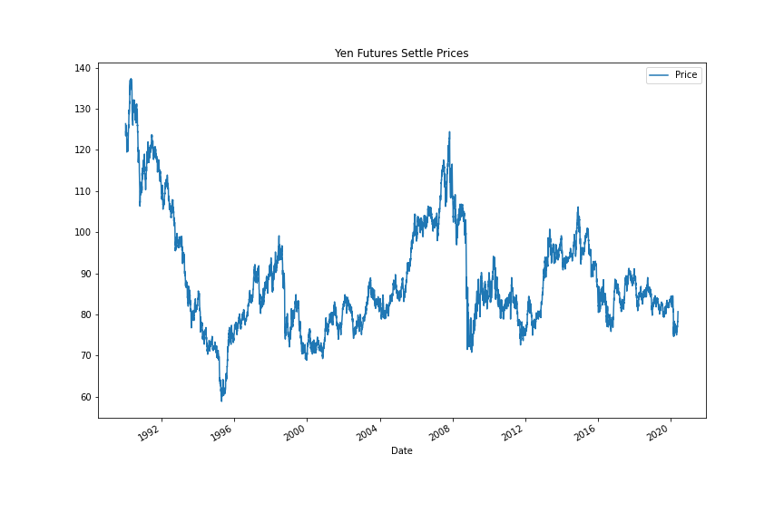
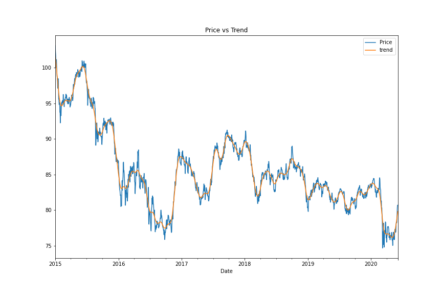
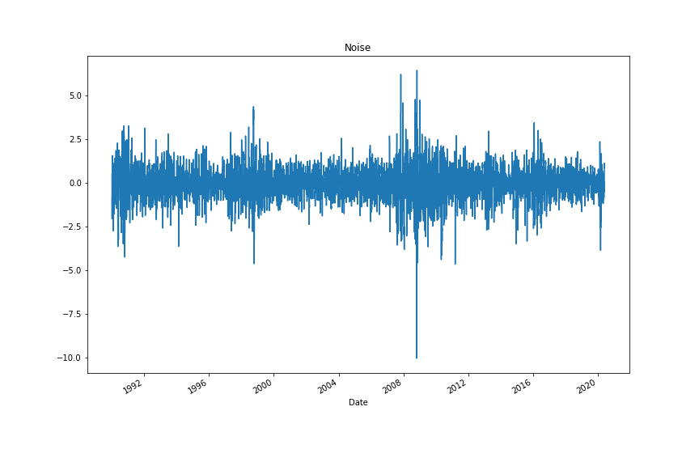
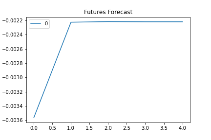
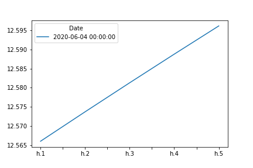

# Homework_10_A_Yen_for_the_Future


## The financial departments of large companies often have to make foreign currency transactions when doing international business, while hedge funds are also interested in anything that will provide an edge in predicting currency movements. Hence, both are always eager to gain a better understanding of the future direction and risk of various currencies.
## In this assessment , by apply time series analysis and modelling to determine if there is any predictable behaviour in future movements in the value of the Canadian dollar versus the Japanese yen.. ##

--------

## Technologies

This notebook leverages Python 3.8 with the following packages in a Jupyter Notebook:
import numpy as np
import pandas as pd
from pathlib import Path
%matplotlib inline
import datetime as dt

import warnings
warnings.simplefilter(action='ignore', category=Warning)

## Installation Guide

Before running the notebook, please install the dependencies:

```python
pip install pandas
pip install alpaca_trade_api
pip install matplotlib
pip install requests
pip install dotenv

```

---

## Observations

# Regression Analysis #

Question: Does this model perform better or worse on out-of-sample data as compared to in-sample data?

Out-of-Sample Mean Squared Error (MSE): 0.273

In-sample Mean Squared Error (MSE): 0.709

Out-of-Sample Root Mean Squared Error (RMSE): 0.523

In-sample Root Mean Squared Error (RMSE): 0.842

Answer: The out-of-sample RMSE is lower than the in-sample RMSE. RMSE is typically lower for training data, but is higher in this case.

# Time Series Analysis #
## Initial Time-Series Plotting 
Question: Do you see any patterns, long-term and/or short?

Answer: In the long term, It seems that the Japanese Yen has weakend against the Dollar but there are a lot of short-term ups and downs



## Decomposition Using a Hodrick-Prescott Filter
Question: Do you see any patterns, long-term and/or short?

Answer: In the the Settle Price vs. the Trend plot, It seems that there's a lot of short term fluctuations that deviate around the trend. The Noise plot gave us a visualization of where the most noise is on this chart. These points can be correllated with volatile periods in the market.





## Forecasting Returns
Question: What does the model forecast will happen to the Japanese Yen in the near term?

Answer: Again, based on the summary table, the p-values for each lag did not show to be statistically significant - none are less than 0.05. Based on the ARIMA model, we can see that a decrease in the Yen value compared to the Canadian dollar for the 5 day period tested.




## Volatility Forecasting with GARCH
Question: What does the model forecast will happen to volatility in the near term?

Answer: Based on the GARCH forecast plot , volatility risk of the Yen will increase each day for the next 5 days.




# Conclusions
1.Based on your time series analysis, would you buy the yen now?

   According to ARMA and ARIMA models, the Japanese Yen will decrease relative to the Canadian dollar, however, there might be an unreliable coefficient that might cause misleading result because the p-values are greater than 0.05. Thus, I would not buy the Japanese Yen.

2.Is the risk of the yen expected to increase or decrease?
    Based on the GARCH forcast, volatility risk of the Yen will increase each day.

3.Based on the model evaluation, would you feel confident in using these models for trading?
    Again, due to p- values are not less than 0.05, I do not feel confident in using these models for trading.

## Contributors

By: Roy Booker

---

## License

MIT
